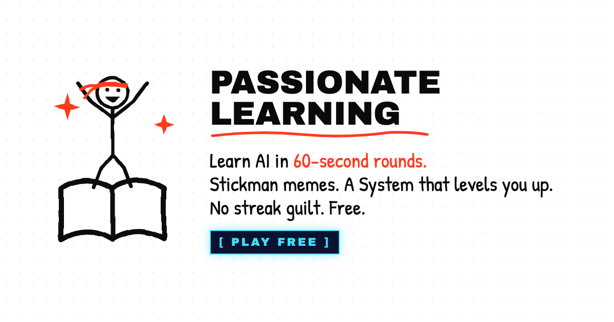

<p align="center"></p>

# Passionate Learning

**A free learning game about AI and tech. 60-second rounds. Stickman memes. A System that levels you up. No streak guilt.**

**Play:** https://passionate-learning.vercel.app · install it on your phone from the browser menu (Add to Home Screen).

Passionate Learning is one app with a growing catalogue of **worlds**. Every world teaches one thing through short rounds of cards that ask before they explain. A stickman reacts to every answer, a meme explains the idea, and old cards come back right before you'd forget them.

It's built in the open. **A new world is one data file**, so anyone who just learned something can teach it.

## What's in it

| World | Teaches | Cards |
|---|---|---|
| Prompt Dojo | Talking to AI so it actually helps | 18 |
| Token Temple | How AI thinks, one token at a time | 17 |
| Cap Detector | Catching AI when it makes things up | 15 |
| Red Team | How AI gets tricked, and how to protect it | 10 |
| Bias Check | When AI treats people unfairly, and why | 10 |
| Tool Shop | Picking the right tool (sometimes it's not AI) | 15 |
| Net Run | How the internet moves your stuff | 35 |
| Circuit Lab | How computers work, down to the wires | 27 |
| Speed Keys | Typing tech words at full speed | 16 |
| *Deepfake Detector, Scam Radar, Code Dojo, AI at Work* | **coming soon: help build them** | |

Plus an arcade break (What's Poppin) you pay for with tokens earned from rounds.

## How it teaches

- **Problem first.** Every card asks before it explains.
- **60-second rounds.** Five to eight cards. One round counts as a whole day. Finish inside 60 seconds of thinking time for a speed bonus; there is no penalty for going slower.
- **No streak to lose.** The app counts days played, never days missed. A missed day resets nothing.
- **Spaced repetition (FSRS).** Cards you got wrong, or haven't seen in a while, come back across every world. Remembering a card after 7 days pays 2x XP, after 30 days 3x.
- **Mastery gates (Kumon style).** Clear a unit at 70% to open the next; master it at 90% over your last three rounds.
- **Ranks E to S**, announced by the System. A daily quest of three small goals, never punished.

## The look

Black ink on white paper with one vermilion accent, drawn with a hand-coded SVG stickman kit (no generated art), interrupted by dark glowing System windows for quests and rank-ups. Fonts: Archivo Black, Archivo, Patrick Hand, JetBrains Mono.

## Contribute

New worlds, card fixes, game ideas, art, translations: see **[CONTRIBUTING.md](CONTRIBUTING.md)**. The fastest first contribution is a new unit of 5 cards for a world you know something about. Ideas and questions go in [Discussions](https://github.com/DareDev256/passionate-learning/discussions).

## Run it

```bash
cd app
npm install
npm run dev          # http://localhost:3000
npm test             # engine + content tests
npm run validate     # checks every card in the catalogue
npm run build        # static export to app/out
```

Stack: Next.js 16 (static export) · React 19 · TypeScript · Tailwind v4 · ts-fsrs · Vitest. The app works offline (service worker) and installs as a PWA; an iOS/Android wrapper (Capacitor) is next.

## Repo map

| Path | What |
|---|---|
| `app/` | **The app.** Content lives in `app/src/content/worlds/`. |
| `app/src/lib/` | The engine: save, ranks, FSRS memory, rounds, grading. |
| `app/src/art/` | The stickman kit, the logo, the meme cards. |
| `docs/specs/` | The design spec and the build notes. |
| `template/`, `specs/` | The original separate-games template (v1 of the suite), kept for history. |

MIT licensed. Made by [James Dare](https://jamesdare.com) (DareDev256) in Toronto, with the community.
